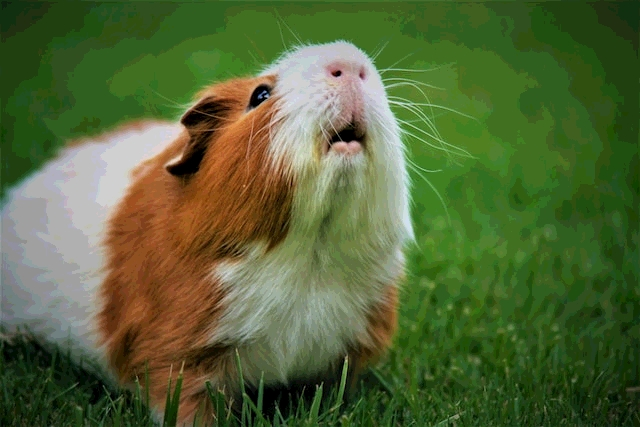

# Image Steganography

This project implements a command line utility that can be used to embed an
image within another. The method used here is known as least significant bit
steganography which uses n-bits of each color channel to embed hidden
information in a container image. Be wary, this method is susceptible to [noise
detection techniques][1] and so is not a particularly effective method if one's
goal is to go undetected!

Below is a capture showing merged and unmerged images. On the left is the result
of merging a [container](examples/container.jpg) image with a
[secret](examples/secret.jpg) image. On the right, we have the unmerged image.
There's some obvious loss in quality, but the extracted image is still
recognizable.

<p float="left" align="center">
  
  
</p>

### Program Usage

The `steg` tool supports two commands: `merge`, and `unmerge`.

The `merge` command takes four arguments where the first is the container image,
the second is the secret image, the third is the output path of the merged
image, and the fourth is the number of bits to use for embedding the secret
image:

```bash
steg merge container.jpg secret.jpg merged.png 4
```

> **Note**
> The merged image's format should be a lossless format! Lossy formats like JPEG
> will result in a loss of quality when unmerging the image.

The `unmerge` command takes three arguments where the first argument is an image
previously constructed using the `merge` command, the second argument is the
output path of the unmerged image, and the third argument is the number of bits
used to embed the secret image:

```bash
steg unmerge merged.png unmerged.jpg 4
```

[1]: https://dl.acm.org/doi/book/10.5555/1329756
