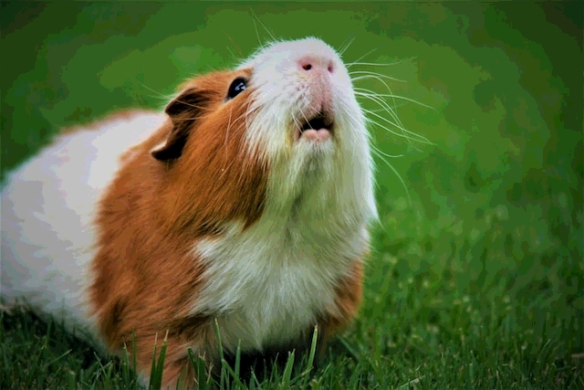

# Image Steganography

This project implements a command line utility that can be used to embed an
image within another. The method used here is known as least significant bit
steganography specifically using the lowest 4-bits of each color channel to
embed hidden information in a container image. Be wary, this method is
susceptible to [noise detection techniques][1] and so is not a particularly
effective method if one's goal is to go undetected!

Below is a capture showing merged and unmerged images. On the left is the result
of merging a [container](resources/container.jpg) image with a
[secret](resources/secret.jpg) image. On the right, we have the unmerged image.
There's some obvious loss in quality, but the extracted image is still
recognizable.

<p float="left" align="center">
  
  
</p>

### Local Builds

To build the project locally, you will need the following libraries and tools
installed:

* CMake3.13+
* C++ compiler supporting C++20 features
* libpng developer libraries
* libjpeg developer libraries
* Boost version 1.76.0+

To build the project, change directory to the `scripts/` directory and run
`build.sh` (optionally pass the `-g` flag to build with debug symbols):

```bash
./build.sh
```

After a successful build, you will find the binary installed to
`steganography/bin/steganography`.

### Running with Docker

The project includes a [Dockerfile](Dockerfile) that builds an image with the
`steganography` tool installed. To build the image, run the following command
from the project root directory:

```bash
docker build . -t steganography:latest
```

Included in the `scripts/` directory is the `container.sh` script which launches
the steganography container with a host volume mounted. The host volume can
contain images to be run against the tool. Just edit the `STEG_IMAGES` variable
to the absolute path of the directory containing your images, then navigate to
`/mnt/images` within the container shell and run the tool as explained in the 
[Program Usage](#program-usage) section.

### Program Usage

The `steganography` tool interprets three commands: `help`, `merge`, and
`unmerge`.

The `help` command prints program usage info:

```bash
steganography help
```

The `merge` command takes three arguments where the first is the container
image, the second is the secret image, and the final is the desired name for the
merged image:

```bash
steganography merge container.jpg secret.jpg merged.png
```

> **Note**
> The output image is ALWAYS in the PNG format. The reason is that the JPEG
> format uses lossy compression meaning we cannot reliably unmerge a merged
> image written as a JPEG.

The `unmerge` command takes two arguments where the first argument is an image
previously constructed using the `merge` command and the second argument is the
desired name for the unmerged image:

```bash
steganography merged.png unmerged.jpg
```

Only JPEG and PNG formats are supported as output formats.

[1]: https://dl.acm.org/doi/book/10.5555/1329756
